# [Game Name]

> Heads up: most of this project — code, assets, and this README — was built with a lot of AI help. Nothing here is hand-crafted from scratch, and that's by design.

A browser-based car customization and road-trip game. Build and tune your dream car, then drive it between cities to earn money, complete quests, and unlock new parts.

**[Play the live demo](https://moritz1436.github.io/Game/)**

---

## Overview

Travel across a procedurally generated map, visiting different cities that each offer their own set of activities. Earn money, customize your car from the ground up, and take on quests along the way.

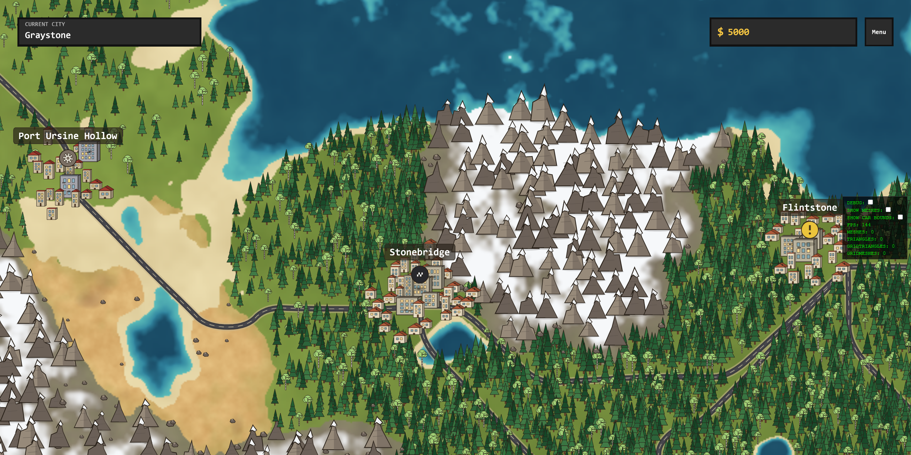
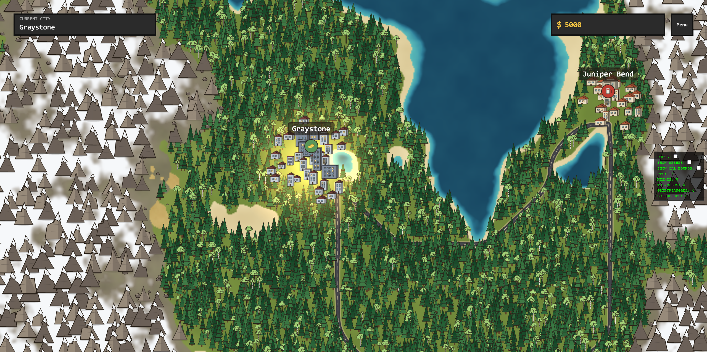

## Features

### Car Customization
Customize your car piece by piece:
- **Base** — choose the foundation of your car (Lambo-, BMW-, Audi-style bases, and more)
- **Parts** — swap tires, spoilers, and other attachable components
- More part categories planned for future updates

### Traveling Between Cities
Drive between cities on the map to reach new opportunities. Each city has its own set of features to offer.

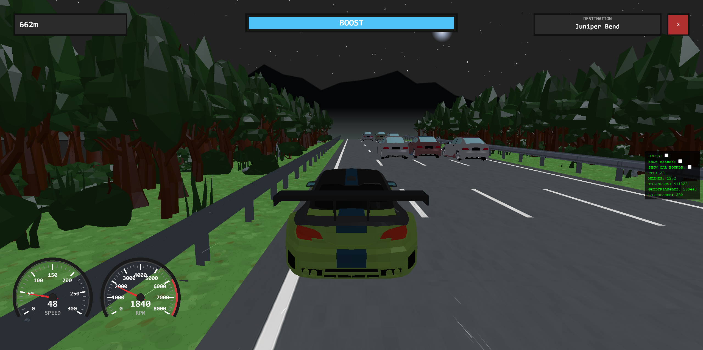
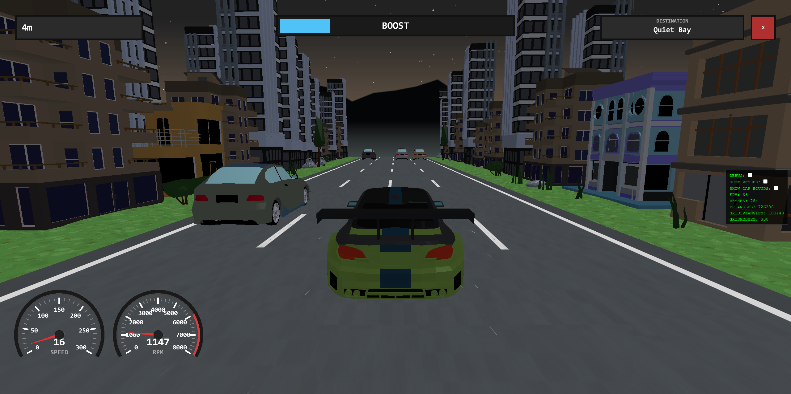

### Cities

Each city can offer one or more of the following:

#### Shop
Buy crates containing random rewards — in-game money, car stat boosts, or new parts, including some exclusive parts not obtainable in the garage.

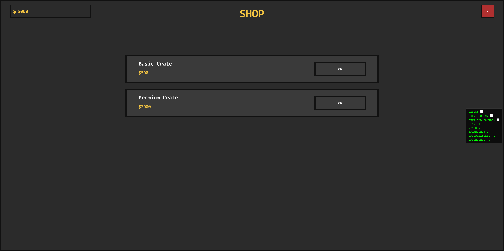
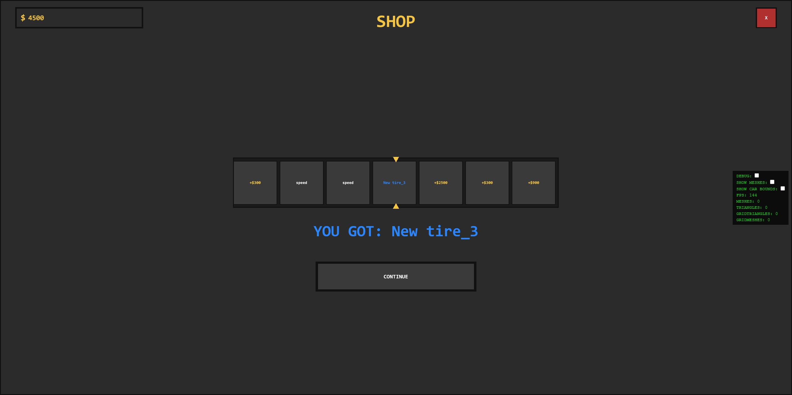

#### Garage
The garage is where you fully customize your car, split into four menus:

- **Parts** — attach different tires, spoilers, and other components, or switch your car's base entirely
- **Color** — recolor every part and every individual mesh on it, with full control over RGB, metallic, and roughness
- **Upgrades** — improve your car's stats, such as speed, boost time, and more
- **Modifiers** — fine-tune the position and rotation of parts, e.g. lowering the car's ride height or angling the wheels (camber)

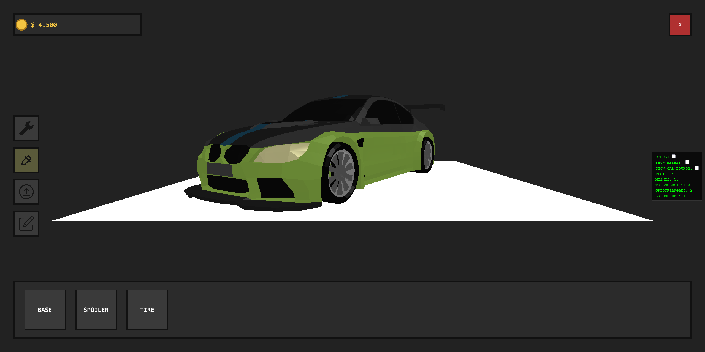
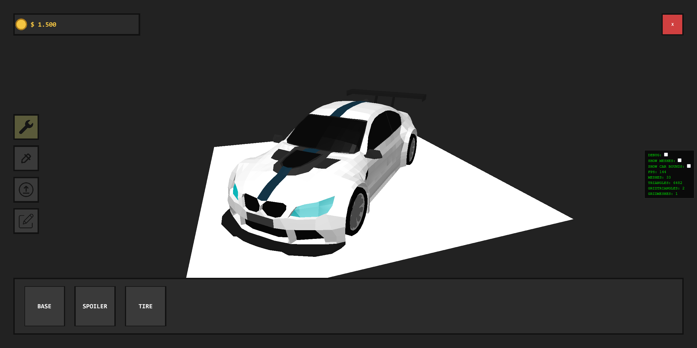
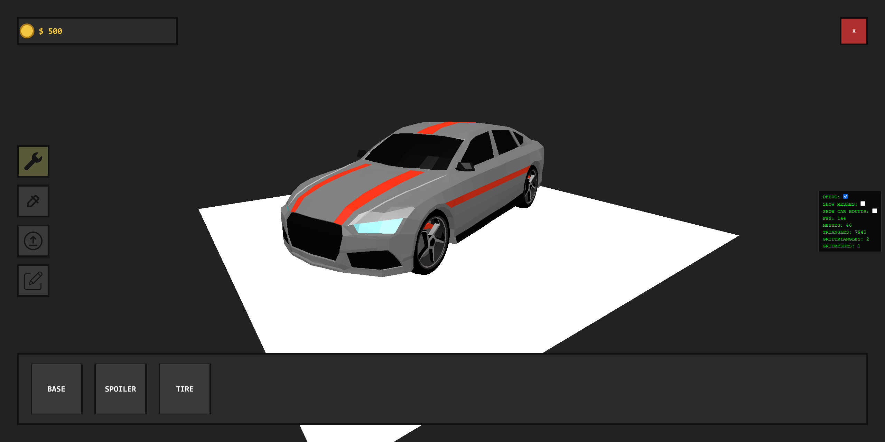

#### Quests
Complete tasks for cash rewards — drive a certain distance, deliver cargo from one city to another, or stay accident-free for a set trip.

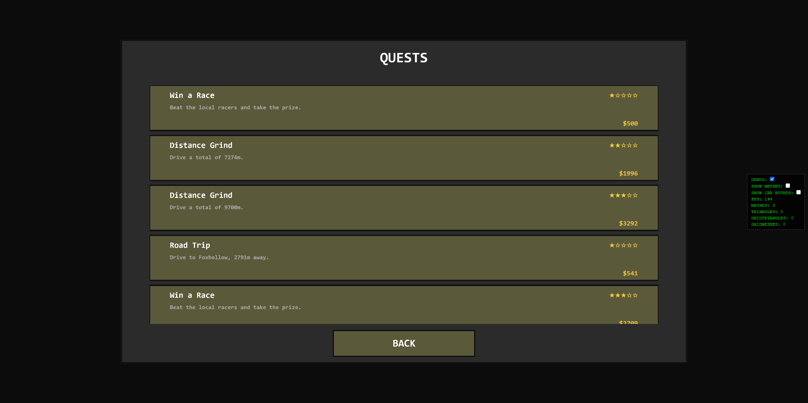
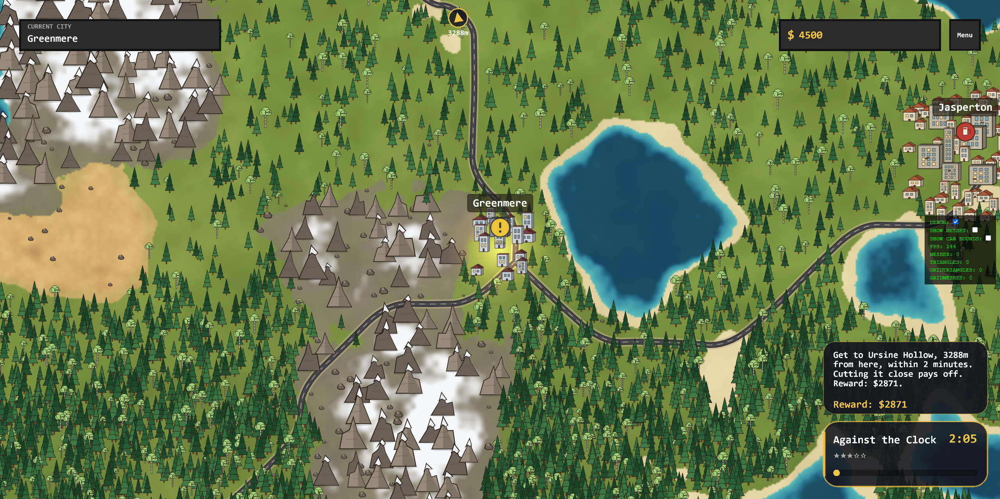

#### Gas Station *(coming soon)*
Refuel your car and maybe view the Car of other real players. Not implemented yet.

#### Race Track *(coming soon)*
Go head-to-head against local racers for cash and bragging rights. Not implemented yet.

## Tech Stack

- **JavaScript** (ES modules)
- **[Vite](https://vitejs.dev/)** — build tool and dev server
- **[PixiJS](https://pixijs.com/)** — 2D/3D rendering
- **[simplex-noise](https://www.npmjs.com/package/simplex-noise)** — procedural terrain generation

## Getting Started

```bash
# Install dependencies
npm install

# Start the dev server
npm run dev

# Build for production
npm run build

# Preview the production build locally
npm run preview
```

The production build is output to the `dist/` folder.

## Deployment

The game is deployed to [GitHub Pages](https://moritz1436.github.io/Game/) automatically on every push via GitHub Actions — see `.github/workflows/deploy.yml`.

## Roadmap

See [TODO.md](./todo.md) for planned features and known issues.

## License

All rights reserved. This project is shared publicly so people can play and read the code, but you may not copy, redistribute, or republish it (in part or in full) as your own work, modified or not, without explicit permission from the author.